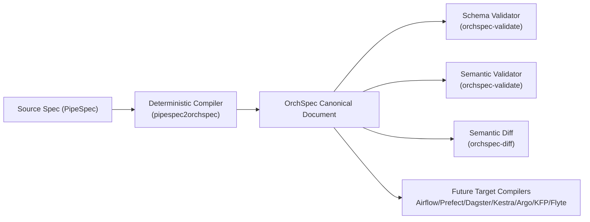
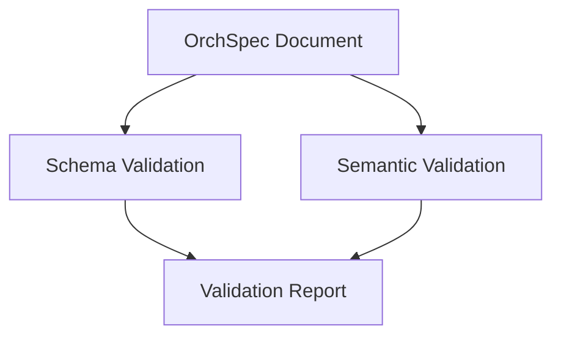
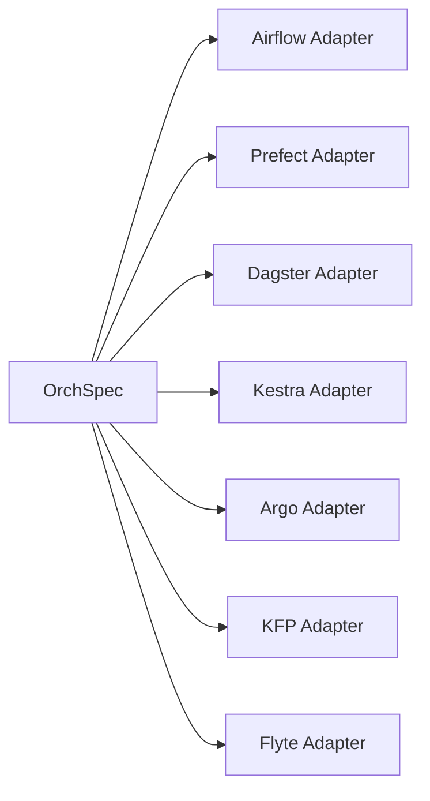
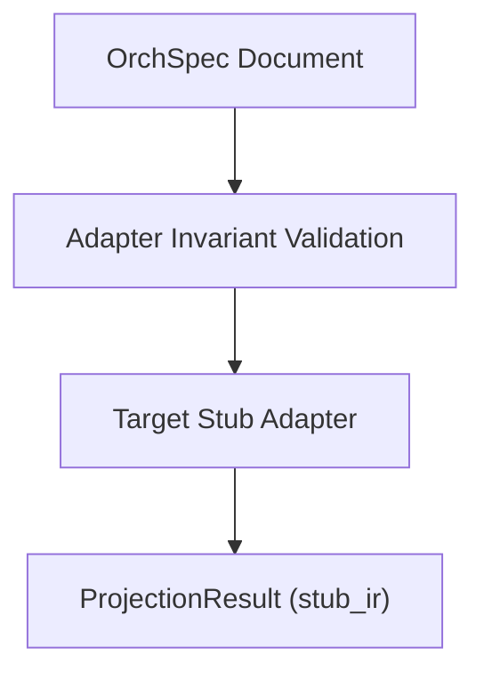

# OrchSpec Technical Design

## 1. Purpose

OrchSpec (Open Pipeline Orchestration Specification) is a universal abstraction layer for pipeline generation.

It separates three concerns:
1. **Understanding** pipeline intent (`PipeSpec` input).
2. **Normalizing** that intent into one stable canonical form (`OrchSpec`).
3. **Projecting** OrchSpec into multiple orchestrator-specific outputs (Airflow, Prefect, Dagster, Kestra, Argo, KFP, Flyte).

In this repository, the implemented scope is:
- Deterministic `PipeSpec -> OrchSpec` compilation.
- OrchSpec schema and semantic validation.
- OrchSpec semantic diff for auditing and regression checks.

## 2. Why OrchSpec as a Universal Layer

Without OrchSpec, every source format must map directly to every target orchestrator.
That causes a combinatorial integration problem.

With OrchSpec:
- You build each source-to-OrchSpec mapping once.
- You build each OrchSpec-to-target compiler once.
- You gain shared validation and comparison across all targets.

### Integration complexity
- Direct model: `N sources * M targets` integrations.
- OrchSpec model: `N + M` integrations around a stable core.

## 3. High-Level Architecture

## 4. Repository Modules and Responsibilities

- `spec/orchspec_schema_v1.json`
  - Canonical JSON Schema for OrchSpec v1.0.
- `src/orchspec_validator/compiler/`
  - PipeSpec parsing, normalization, deterministic mapping, strict error handling.
- `src/orchspec_validator/validation/`
  - JSON Schema validation plus semantic rules (`SEM001..SEM010`).
- `src/orchspec_validator/diff/`
  - Meaning-level change detection with breaking/non-breaking classification.
- `src/orchspec_validator/cli/`
  - User-facing tools: `pipespec2orchspec`, `orchspec-validate`, `orchspec-diff`.

## 5. Data Model: PipeSpec to OrchSpec

Core transformation principles:
1. Preserve semantic meaning.
2. Normalize names/types to OrchSpec canonical enums.
3. Omit null/empty optional fields for stable output.
4. Ensure deterministic ordering and serialization.

### Key mapping examples
- `pipeline_summary.name` -> `metadata.name` and normalized `pipeline_id`.
- `flow_structure.pattern` -> `flow.pattern`.
- `flow_structure.edges[]` -> `flow.edges[]`.
- `executor_type` -> `executor.type` by fixed lookup table.
- `integrations.connections[]` -> `integrations[]`.
- `parameters.environment` -> `secrets[]` references.

### Executor mapping table
- `python` -> `python_script`
- `http` -> `http_request`
- `sql` -> `sql`
- `bash` -> `bash`
- `container` -> `container`
- `email` -> `email`
- unknown -> `custom` (or `COMP001` in strict mode)

## 6. Determinism Rules

Determinism is required for reproducible builds and reliable regression tests.

Implemented rules:
1. Integrations are sorted by `id`.
2. Components are ordered by topological DAG order, then deterministic tie-breaks.
3. Flow edges are sorted by `(from, to)`.
4. Output object keys are sorted at serialization time.
5. No runtime-generated timestamps are inserted unless present in input metadata.

### Determinism contract
Given identical PipeSpec input bytes and compiler version, output is semantically identical and canonically serializable.

## 7. Validation Architecture

Validation is layered:

### 7.1 Schema validation
Checks structure, required fields, enums, and primitive constraints.
Error family: `SCHEMA_*`.

### 7.2 Semantic validation
Checks cross-field and graph-level invariants that schema alone cannot enforce.
Error family: `SEM001..SEM010`.

Implemented semantic checks:
- `SEM001`: entry points must exist in components.
- `SEM002`: each edge endpoint must reference known components.
- `SEM003`: DAG must be acyclic for sequential/parallel/dag.
- `SEM004`: component `integrations_used` must be declared.
- `SEM005`: I/O `integration_id` must be declared.
- `SEM006`: referenced secrets must exist.
- `SEM007`: component/integration IDs must be unique.
- `SEM008`: sequential flow cannot branch fan-out > 1.
- `SEM009`: schedule enabled requires cron.
- `SEM010`: category/executor compatibility warning.

## 8. Compile Error Taxonomy (`COMP00x`)

Compiler strict mode uses stable error IDs:
- `COMP001` unsupported executor type.
- `COMP002` missing component id.
- `COMP003` missing component name.
- `COMP004` missing component category.
- `COMP005` missing IO name.
- `COMP006` missing IO kind.
- `COMP007` missing integration id.
- `COMP008` unsupported PipeSpec version.
- `COMP009` empty component list.
- `COMP010` missing pipeline name.
- `COMP011` missing pipeline description.

These IDs make failures scriptable and easy to assert in tests.

## 9. Semantic Diff Design

`orchspec-diff` compares OrchSpec documents at meaning-level, not raw text-level.

Core behavior:
1. Compare top-level identity fields.
2. Compare components by stable `id`.
3. Compare integrations by stable `id`.
4. Compare DAG edges as logical sets.
5. Report field-level path changes (for example `components.task_a.executor.type`).

Change classes:
- `breaking`: graph/task behavior impact.
- `non_breaking`: integration/catalog metadata impact.
- `informational`: metadata only.

## 10. Testing Strategy

The implementation uses layered tests:
1. **Unit tests** for compiler, validator, and diff logic.
2. **CLI tests** for exit-code and I/O contracts.
3. **Golden tests** for deterministic compiler regression.
4. **Sample corpus** for positive and negative fixtures.

### Golden workflow
- Check: `python tools/golden.py --check`
- Regenerate intentionally: `python tools/golden.py --update-golden`

## 11. Sample PipeSpec Corpus for Taxonomy Coverage

A dedicated corpus lives in:
- `samples/pipespecs/valid/`
- `samples/pipespecs/invalid_compile/`
- `samples/pipespecs/invalid_semantic/`

It includes short fixtures for:
- clean pass scenarios,
- strict compile taxonomy (`COMP`),
- post-compile semantic taxonomy (`SEM`).

This enables fast smoke tests and deterministic regression checks.

## 12. Multi-Orchestrator Positioning

Current repository scope stops at OrchSpec-level standardization and quality gates.

Future adapters can map OrchSpec to orchestrators:
- Imperative: Airflow, Prefect, Dagster.
- Declarative/container-native: Kestra, Argo Workflows, Kubeflow, Flyte.

### Planned projection architecture

Each adapter should remain thin by relying on OrchSpec-normalized semantics.

## 13. Rules for Extension

When extending OrchSpec or compiler logic:
1. Prefer additive, backward-compatible schema changes.
2. Keep error IDs stable and never reuse old IDs for new meanings.
3. Add test fixture + unit test for every behavior change.
4. Update golden files only when intended mapping behavior changes.
5. Document rule changes in `docs/changelog.md`.

## 14. Operational Usage Pattern

Recommended pipeline in CI/CD:
1. Compile PipeSpec to OrchSpec with strict mode.
2. Validate generated OrchSpec.
3. Compare OrchSpec against previous version using semantic diff.
4. Enforce golden check to prevent accidental mapping drift.
5. Publish artifacts and reports.

This keeps generated pipelines reproducible, auditable, and portable.

## 15. Summary

OrchSpec acts as a stable semantic contract between pipeline intent and execution platforms.

The implementation in this repository provides:
- deterministic normalization (`PipeSpec -> OrchSpec`),
- structured correctness checks (schema + semantics),
- auditable change tracking (semantic diff),
- and repeatable quality controls (sample corpus + golden tests).

This foundation enables confident multi-orchestrator pipeline generation at scale.

## 16. New v1.1 Hardening Additions

This implementation now includes four hardening steps:
1. **Strict PipeSpec Profile**: enforced by `spec/pipespec_profile_v1.json` before compile starts.
2. **Formal Mapping Spec**: `spec/mappings/pipespec_to_orchspec_v1.json` drives mapping tables and invariants.
3. **Expanded Semantic Rules**:
   - `SEM011` unreachable components
   - `SEM012` disconnected subgraphs
   - `SEM013` retry policy coherence
   - strict mode promotion of `SEM010` warning to error
4. **Adapter Interfaces**: `src/orchspec_validator/adapters/` provides a stable projection interface and stub adapters for future targets.

### Strict Validation Mode

`orchspec-validate --strict` now enforces stronger compatibility checks by promoting compatibility warnings into errors.

### Adapter Interface Flow

